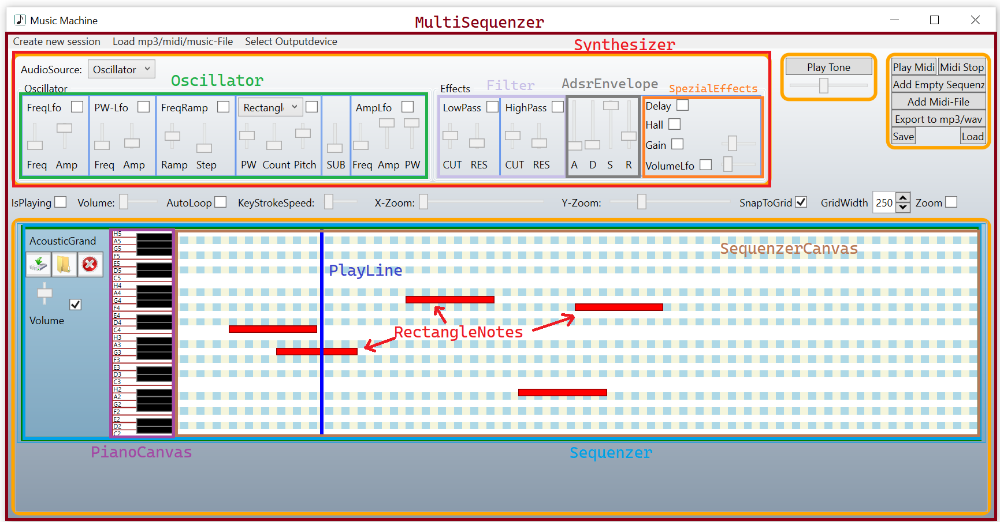
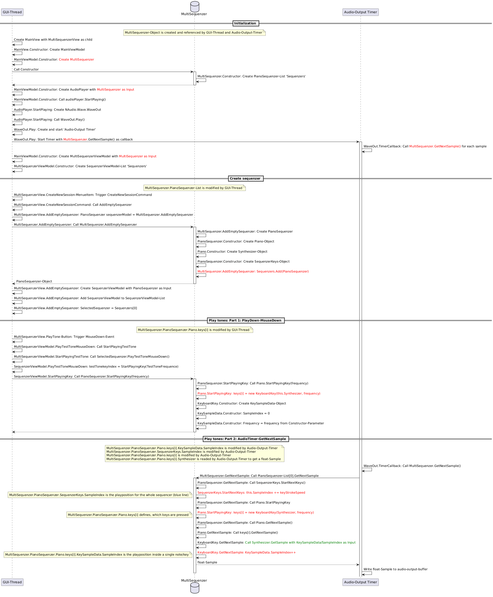
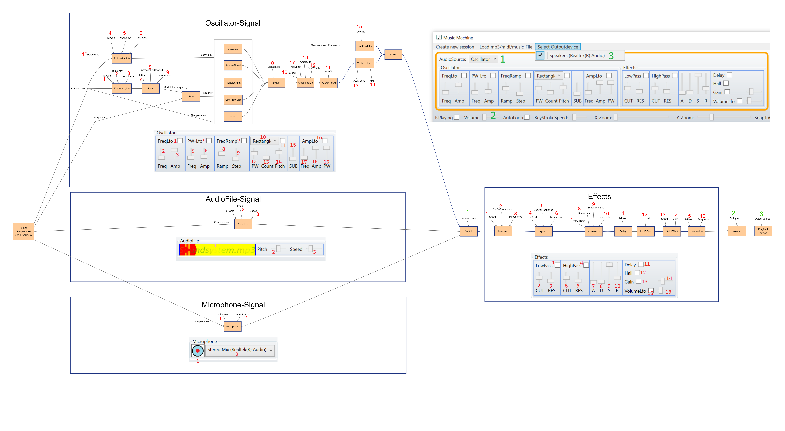

Developer documentation
=======================

The MusicMachine-Project is a WPF-Project, which defines a view with several usercontrols.
The components from the view are shown here.

There is a GUI-Thread and a audio-timer-thread, which writes to the audiodata buffer.
The data from this buffer is then used for the audio-output-device. The buffer is a byte-array and each 
field is called a sample. The audio-timer is using a ISingleSampleProvider-object, which gives the value 
from each sample as a float-value. This value is converted by NAudio to a byte. The MultiSequenzer-class
implements the ISingleSampleProvider-interface. This object is used for the communication between the 
GUI-Thread and the audio-timer-thread. The audio-timer-thread writes only the following properties from 
the MultiSequenzer-object which change the sampleposition- and keyPress-state from this object:
* MultiSequenzer.PianoSequenzer.Piano.keys[i].KeySampleData.SampleIndex -> playposition inside a single note/key
* MultiSequenzer.PianoSequenzer.SequenzerKeys.SampleIndex -> playposition for the whole sequencer (blue line)
* MultiSequenzer.PianoSequenzer.Piano.keys[i]	-> Which key is pressed?

The MultiSequenzer.GetNextSample()-function will return a float-samplevalue depending from the 3 
varialbes, named here.
The GUI-Thread can change any other variable/state inside the MultiSequenzer-object. The other variables are 
used to define the instruments and the notes. 

To get a better understanding how the GUI-Thread and the audio-timer-thread is working together to create 
a tone the following sequence-diagram shows the interaction:

To create a audio-signal the MultiSequenzer-object uses the Synthesizer-class. This class has several 
IPianoComponent-objects, which are linked to each other.

The components/signalflow from the Synthesizer are the followings:

Project structure:

The MusicMachine-Project is the WPF-Project which helps to create a .music-file.

The WaveMaker project defines the ISingleSampleProvider, which returns with the GetNextSample()-function a 
float-sample. The IAudioFileHandler returns with GetSamplesFromAudioFile() a float-array. This project contains 
all the logic to generate a float sample. The synthesizer class then defines the individual components 
(oscilloscope, audio file, effects; all implement IPianoComponent) that make up the float sample signal path.

The PianoSequencer has a Synthesizer object that provides the float array samples, and it also knows all the 
sequencer keys, so it knows when to play a note. It has a GetNextSample method, which is called by the MultiSequencer.

The MultiSequencer has a list of PianoSequencer objects. Each object represents a separate instrument with its own notes. 
The MultiSequencer also implements the ISingleSampleProvider interface.

My NAudioWaveMaker.AudioPlayer class encapsulates the NAudio NuGet package from the main project. This class receives an 
ISingleSampleProvider object (our MultiSequencer) in its constructor. In this class, a thread is started via the WaveOut NAudio class 
using Play, which then requests audio samples in blocks.

The MainViewModel class creates the MultiSequencer object, which then provides the float samples for the NAudio thread from the 
AudioPlayer/WaveOut class, but is also used by the MultiSequencerViewModel to receive control commands (defining notes/instruments).

The SoundEngine project is about using an existing .music/.mp3/.synt file to play it. The SoundSnippedCollection implements the 
ISingleSampleProvider interface, which provides the audio data to the AudioPlayer object. This AudioPlayer then also starts the 
Audio-GetSamples thread.

For the microphone, I have the AudioRecorder class, which reads float samples from the microphone via the NAudio.Wave.WaveInEvent 
class and then buffers them for 2 seconds so that they can then be send to the output-device by calling GetNextSample.
The AudioRecorderPianoComponent class then uses AudioRecorder to make the microphone usable as a signal source for the synthesizer. Since 
the synthesizer is used via the PianoSequencer, this means that GetNextSample is only called from the synthesizer if the PianoSequencer has 
created a SequencerKey object. Therefore, the PlayTestTone key is "held" by the MicrophoneViewModel as long as it is in the IsRecording state.