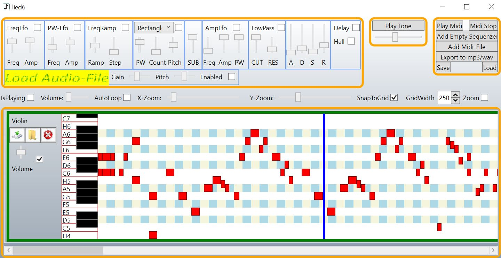

SoundEngine
============
This is a synthesizer which can be used to create single soundeffects but also music files. The importer/exporter supports midi/mp3/wma/wav-Files. I use this synthesizer for my games.

Images
------
This is the synthesizer:

Features
--------
Supported oszilators:
* Sinus
* Rectangle
* Triangle
* SawTooth
* Noise

Supported low frequency oszilators
* Frequency modulation
* Pulse-width modulation
* Amplited modulation

Supported envelope generator
* ADSR(attack, decay, sustain, release)

Supported filter
* Low Pass

Effects
* Frequency ramp
* Delay
* Hall
* Gain
* Pitch

Dependencies
------------
* NAudio
* ReactiveUI
* DynamicData
* Autofac

Todo
----
* implement the Chorus-Effekt

Used Papers/Tutorials/Links
---------------------------
* https://gamedev.stackexchange.com/questions/29303/audio-programming-resources
* The Scientist and engineers Guide to Didital Signal Processing by Steven W.Smith
* Einführung in die digitale Signalverarbeitung - Prof. Dr. Stefan Weinzierl [1996]
* https://www.youtube.com/watch?v=q_3d1x2VPxk
* https://blogs.msdn.microsoft.com/dawate/2009/06/25/intro-to-audio-programming-part-4-algorithms-for-different-sound-waves-in-c/
* https://www.codeproject.com/Articles/3382/Programming-Audio-Effects-in-C
* https://www.tu-chemnitz.de/informatik/ThIS/downloads/courses/ws02/datkom/Fouriertransformation.pdf
* https://www.bonedo.de/artikel/einzelansicht/synthesizer-basics-folge-1/2.html
* http://creatingsound.com/2014/02/dsp-audio-programming-series-part-2/
* http://www.i6.in.tum.de/pub/Main/TeachingSs2003AlgorithmenWerkzeugeAudiobearbeitung/v2-Digitale-Filter.pdf
* https://www.hdm-stuttgart.de/~curdt/_Digitale_Filter.pdf
* https://ti.tuwien.ac.at/cps/teaching/courses/sigproz/files/DesignFIR.pdf
* https://www.c-plusplus.net/forum/306296-full 
* https://github.com/vinniefalco/DSPFilters/tree/master/shared/DSPFilters/source
* https://ti.tuwien.ac.at/cps/teaching/courses/sigproz/files
* https://llllllll.co/t/digital-allpass-filters/27398
* https://ccrma.stanford.edu/~jos/pasp/Allpass_Filters.html
* https://ccrma.stanford.edu/~jos/pasp/One_Multiply_Scattering_Junctions.html
* https://ccrma.stanford.edu/~dattorro/EffectDesignPart2.pdf
* https://github.com/madronalabs/madronalib/blob/master/source/DSP/MLDSPFilters.h

Usage
-----
Create with the editor (MusicMachine-Project) a .music-file. Use the SoundGenerator-class to load this file and play sounds in your game.
Example for usage is in the SoundEngineTest-Project. 

The developer-documentation is shown here: [developer-documentation](./Documentation/documentation.md)

The user-documentation is here: [user-documentation](https://github.com/XMAMan/SoundEngineExamples/blob/main/readme.md)

License
-------

All rights reserved.
